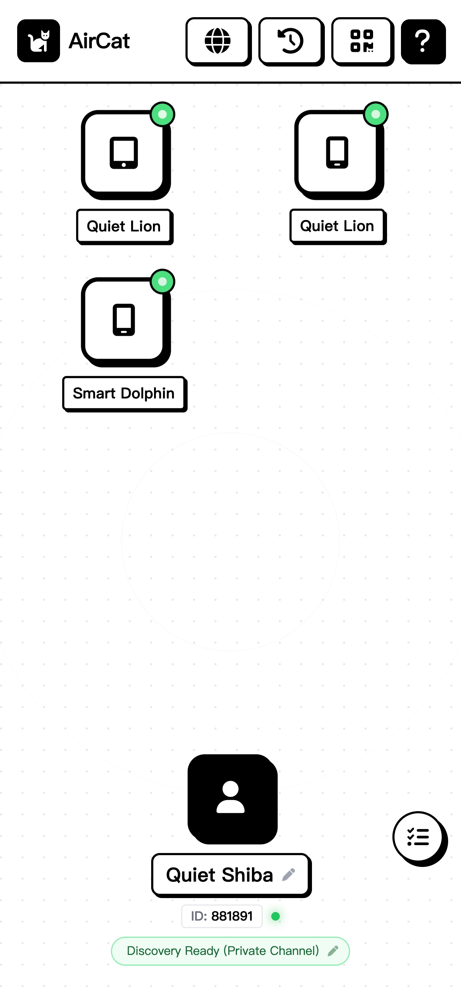
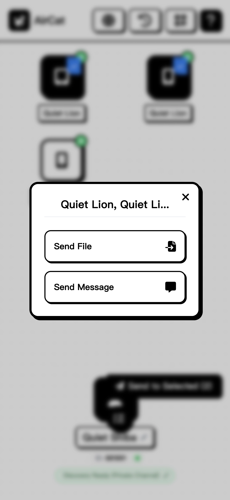
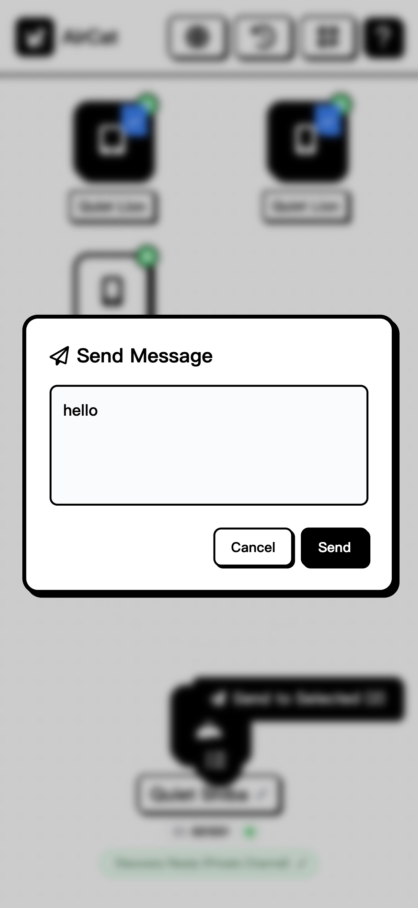

<div align="center">
  <h1>🐱 AirCat</h1>
  <p><strong>一款極簡、極速的 P2P 檔案傳輸與設備發現工具。</strong></p>
  <p>無需留下任何痕跡，安全地在設備間直接分享檔案與訊息。</p>
</div>

---

## 🚀 專案介紹

**AirCat** 是一個輕量級、完全開源的 P2P（點對點）檔案與訊息共享應用程式。設計理念以高效能、易用性以及零配置為核心。

預設情況下，AirCat 完全基於瀏覽器的 WebRTC 運行，這意味著**它可以完全在無伺服器 (Serverless) 的模式下運作**。檔案透過設備對設備直接傳輸（基於 WebRTC 原生的點對點加密 (E2EE)），資料絕對不會經過任何中心化的儲存伺服器。

針對進階使用場景（例如：在嚴格的 NAT 網路架構下需要更穩定的跨網段設備發現功能），我們也提供了一個選配的輕量級 Node.js **信令伺服器 (Signaling Server)**。

<div style="display: flex;">
  
  
  
</div>

## ✨ 核心特色

- **純 P2P 傳輸**：使用 PeerJS 建立 WebRTC 連線，設備間直接傳送檔案。
- **預設無伺服器 (Serverless)**：可將靜態前端檔案 (`/web`) 部署至任何 CDN、GitHub Pages 或 Cloudflare Workers — 完全不需要後端。
- **跨平台與多設備支援**：在手機、平板與桌面瀏覽器皆可無縫運作，支援多選與廣播發送功能。
- **QR Code 快速配對**：內建經過優化的 QR Code 掃描器，行動裝置配對輕而易舉。
- **極致的效能優化**：無任何阻礙渲染 (Render-blocking) 的資源。CSS 已完全編譯並內聯 (Inlined)，JavaScript 經優化且動態載入，在 PageSpeed Insights 上獲得近乎完美的評分。
- **安全可靠**：選配的信令伺服器原生整合 `helmet`，並具備智慧死連線清除機制，有效防止 DDoS 攻擊與記憶體外洩。
- **多國語言支援 (i18n)**：開箱即用，支援英文、繁體中文 (`zh-TW`) 以及簡體中文 (`zh-CN`)。

---

## 🛠 架構模式

AirCat 具備高度彈性，可根據您的基礎設施架構選擇兩種不同的部署模式：

### 模式一：無伺服器 (僅前端)
您不需要執行 `server.js` 也能使用 AirCat。純 HTML/JS 前端會自動退卻使用標準 WebRTC 路由。
- **部署方式**：只要將 `web/` 目錄託管在任何靜態檔案主機上（如 Vercel, Netlify, Cloudflare Pages, S3）。
- **設定要求**：不需任何配置，隨開即用。

### 模式二：自建信令伺服器 (推薦受限網路環境使用)
如果使用者處於限制嚴格的企業網路或部分行動數據環境，導致標準 TURN/STUN 發現機制失效，您可以啟動自訂的 WebSocket 信令伺服器。
- **進階功能**：啟用「自訂房間碼」以及在隔離網段間的即時設備發現。
- **部署方式**：支援 Node.js 或 Docker 部署。

---

## 💻 快速開始

### 執行前端 (無伺服器模式)

1. 複製專案原始碼：
   ```bash
   git clone https://github.com/KKKKKCAT/AirCat.git
   cd AirCat
   ```
2. 使用任何本機伺服器來提供 `web/` 目錄：
   ```bash
   npx serve web/
   # 應用程式現在已執行於 http://localhost:3000
   ```
*(註：若您打算連線至自建的信令伺服器而非預設公開伺服器，請修改 `web/script.js` 中的 WebSocket 連線網址以及 `web/index.html` 的 CSP 設定)。*

### 執行自建信令伺服器

若您希望架設專屬的信令伺服器以獲得更好的連線體驗：

1. 進入專案根目錄：
   ```bash
   cd AirCat
   ```
2. 安裝依賴套件：
   ```bash
   npm install express ws helmet
   ```
3. 啟動伺服器（預設使用 `3000` 通訊埠）：
   ```bash
   node server.js
   ```

**伺服器環境變數：**
- `PORT`: (預設：`3000`) WebSocket 伺服器的運行通訊埠。
- `STATS_TOKEN`: (選填) 設定一組安全的字串。允許您透過 `/stats?token=您的TOKEN` 端點查看伺服器健康狀態。

---

## 🛡 安全亮點

- **防禦惡意日誌寫入**：WebSocket 伺服器會靜默丟棄無效的 JSON 請求，防止惡意攻擊者發送垃圾訊息塞滿伺服器的錯誤日誌或硬碟空間。
- **清除無效連線**：實作了主動的 `ping/pong` 心跳包機制，能優雅地斷開失去回應的客戶端，確保即便擴展到數千名同時上線用戶也能防止記憶體外洩。
- **嚴格的內容安全策略 (CSP)**：前端使用了嚴謹的 CSP 標頭，有效減緩 XSS 攻擊的風險並封鎖未經授權的第三方腳本。

## 🤝 參與貢獻

歡迎任何形式的貢獻、問題回報以及功能請求！
請隨時查看 [Issues 頁面](https://github.com/KKKKKCAT/AirCat/issues)。

1. Fork 本專案
2. 建立您的功能分支 (`git checkout -b feature/AmazingFeature`)
3. 提交您的變更 (`git commit -m 'Add some AmazingFeature'`)
4. 推送至您的分支 (`git push origin feature/AmazingFeature`)
5. 建立 Pull Request

## 📄 授權條款

本專案採用 MIT 授權條款 - 詳見 `LICENSE` 檔案。
